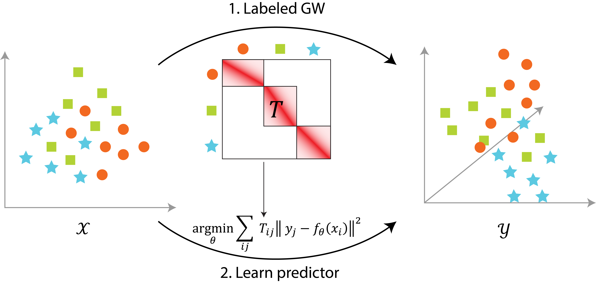

# perturbot
Cross-modality matching and prediction of **perturb**ation response with labeled Gromov-Wasserstein **O**ptimal **T**ransport.



## Repository layout
```
├── .gitignore
├── README.md
├── perturbot
│   ├── cv      # Cross-validation experiments
│   └── perturbot
│       ├── match
│       │    ├── ot_labels.py   # Label-constrained Entropic Optimal Transport
│       │    ├── ott_egwl.py    # Label-constrained Entropic Gromov-Wasserstein
│       │    ├── cot_labels.py  # Label-constrained Co-OT (Redko et al., 2020)
│       │    └── cot_feature.py # Feature-feature OT based on Co-OT concept
│       ├── predict
│       └── eval
├── scvi-tools              # forked `scvi-tools` with label adaptation
└── ott                     # forked `ott` with label adaptation

```

## Installation
`perturbot/` uses the modified `scvi-tools` and `ott` submodules which can be installed with `pip install`.
```bash
cd scvi-tools/
pip install .
cd ../ott/
pip install .
cd ../perturbot
pip install .
```

## Usage
```python
import numpy as np
from sklearn.decomposition import PCA
from perturbot.match import (
    get_coupling_cotl, 
    get_coupling_cotl_sinkhorn, 
    get_coupling_egw_labels_ott,
    get_coupling_egw_all_ott,
    get_coupling_eot_ott,
    get_coupling_leot_ott,
    get_coupling_egw_ott,
    get_coupling_cot, 
    get_coupling_cot_sinkhorn, 
    get_coupling_gw_labels,
    get_coupling_fot,
)
from perturbot.predict import train_mlp

# Generate data
n_samples = 300
labels = [0,1,2,3]
X_dict = {k: np.random.rand(n_samples,1000) for k in labels}
Y_dict = {k: np.random.rand(n_samples,2000) for k in labels}
pca = PCA(n_components=50)
X_reduced = {k: pca.fit_transform(X_dict[k]) for k in labels}
Y_reduced = {k: pca.fit_transform(Y_dict[k]) for k in labels}


# Learn matching in the latent space
T_dict, log = get_coupling_egw_labels_ott((X_reduced, Y_reduced)) # Other get_coupling_X methods be used

# Train MLP based on matching
model, pred_log = train_mlp((X_dict, Y_dict), T_dict)

# Learn feature-feature matching
T_feature, fm_log = get_coupling_fot((X_dict, Y_dict), T_dict)
```
See [documentation](https://perturbot-ryuj6-c30e3f9a4e1c18c118ba07b4ae09f88b307e47aac8d5c0f.pages.roche.com) for more details.
## Support
Please submit issues or reach out to jayoung_ryu@g.harvard.edu.

## Authors and acknowledgment
Jayoung Ryu, Romain Lopez, & Charlotte Bunne
